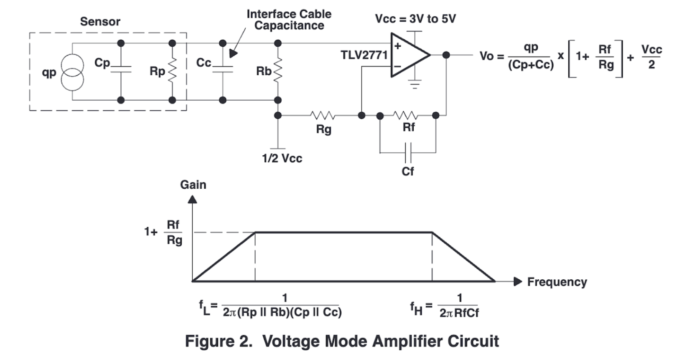
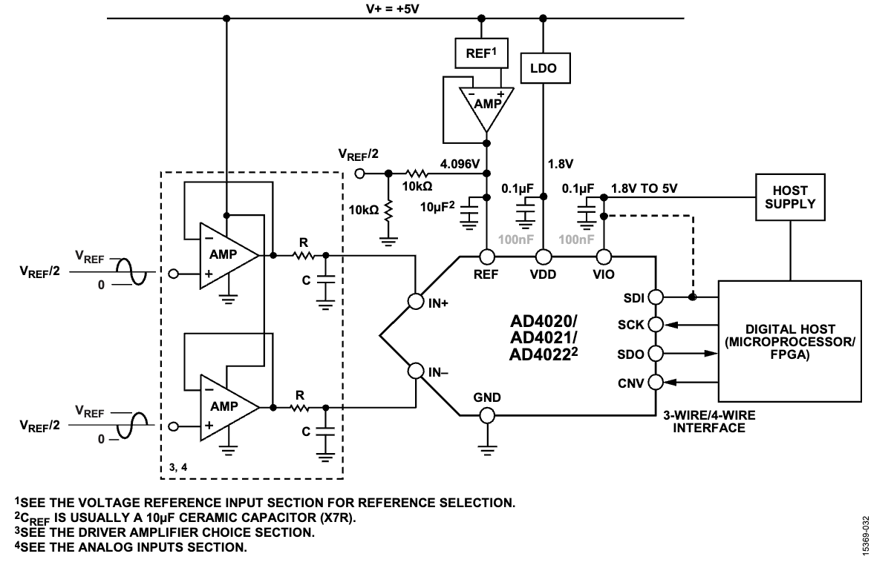

This repo stores hardware design files and datasheets of components we used.

## Files
- `datasheet`: this folder stores datasheets of the ICs/sensors we used.
- `img`: pictures of circuit diagrams
- `kicad components`: stores schematic files and footprints of components
- `tlv2771 breakout`: an easy breakout board for the breadboard testing of the TLV2771 Operational Amplifier chip.
- `piezo_v1`: version 1 of the integrated circuit, including a piezo sensor, preamplification of the sensor reading, and a high sampling rate ADC circuit, which communicates with the MCU (ESP32S3) using the SPI interface.
- `backup_microphone`: this file includes the testing for the backup plan, which is using microphone as the second sensor if piezo or bone conduction cannot work as expected.

## Circuit Diagrams
### Preamplifier 

- `Vcc` uses 3.3v from the ESP32S3.
- `Rb` = 10MOhm
- `Rg` = 1kOhm
- `Rf` = 56kOhm
- `Cf` is not used, since we want to keep the high-frequency signals.
- `1/2 Vcc` is created using a voltage divider (2 x 10kOhm resistor).

### ADC 

With some modifications:
- `IN+` of the ADC is connected to the `Vo` of the preamplifier.
- `IN-` of the ADC is connected to `1/2 Vcc`.
- `V+` line and the `VIO` are connected to the 3.3v from the ESP32S3.
- `VREF` = 3v. This means the ADC can convert voltage from -3v to 3v. In our configuration, however, we will only generate signals from -1/2 Vcc to 1/2 Vcc, which is around -1.65v to 1.65v. This will waste 1-bit resolution of the ADC as we only use half of the voltage range. Hope it could still be accurate enough, or we can develop a differential input for the ADC (rather than directly pulling 1/2 Vcc to the `IN-` of the ADC).

## Main Considerations
### Bandwidth
In our preliminary testing using o-scope, a gain of around 50x can produce a desirable signal for all kinds of surface interactions. The TLV2771 amplifier we used has a Gain Bandwidth (GBW) of 5.1 MHz. The formula to calculate the bandwidth of the op-amp when operating at a specific gain is given by:
\[ \text{Bandwidth} = \frac{\text{GBW}}{\text{Gain}} \]
Where,
    - Bandwidth is the frequency at which the gain of the op-amp falls to 1 (unity gain) when operating at a specific gain setting.
    - GBW (Gain-Bandwidth Product) is a characteristic of the op-amp and is usually specified in the datasheet. It's the product of the bandwidth and the gain at which the bandwidth is measured.
    - Gain is the amplification factor at which the op-amp is operating.

In our case, the gain is 50, then the bandwidth is around 100kHz, which could be sufficient in our case of interacting with surfaces.

If a higher GBW turns out to be necessary, we can use LMP7732, which has a GBW of __22MHz__.

### ADC sampling
The AD4022 chip we used for ADC has a maximum sampling rate of around 500kSPS. 

According to the Nyquist theorem, which states that to avoid aliasing, which is the distortion that occurs when the signal is undersampled, the sampling rate must be at least twice the highest frequency present in the signal. This minimum sampling rate is known as the Nyquist rate.
\[ f_{\text{Nyquist}} = 2 \times f_{\text{max}} \]
Where,
 - $f_{\text{max}}$ is the highest frequency component in the signal.

 Given the bandwidth of the preamplifier is 100kHz, our 500kHz sampling rate could be sufficient.